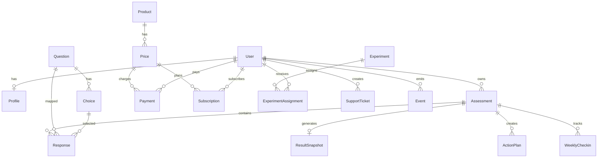

# VibeWeb Growth Lab

수익형 웹앱 실험을 위한 진단형 SaaS MVP입니다.

- 진단 테스트(5축 점수)
- 결과 요약 + 7일 액션플랜
- 유료 PDF 리포트 결제 흐름
- 주간 체크인 + 관리자 실험 API

## 1) Tech Stack

- Next.js 16 (App Router), TypeScript, Tailwind CSS v4
- Prisma + PostgreSQL
- 결제 추상화: Manual/Stripe/Toss/PortOne(테스트 URL 기반)
- Analytics: DB Event + PostHog 옵션
- Email: Resend 옵션

## 2) Architecture Principles

- 확장성/유지보수성 우선: 라우트는 입출력만 담당, 도메인 로직은 `src/server/services` 계층으로 분리
- SOLID:
  - SRP: `AssessmentService`, `CheckoutService`, `ReportService` 등 책임 분리
  - OCP/DIP: `PaymentClient` 인터페이스 기반 결제 공급자 확장
  - ISP: `EventTracker` 계약 분리로 분석 도구 교체 가능
- 하드코딩/매직넘버 제거: `src/config/app-policy.ts` 단일 정책 소스 사용
- 테스트 가능 구조: 핵심 로직 모듈을 순수 함수/클래스로 분리하고 Vitest 단위 테스트 구성
- 로깅 구조: `src/lib/logger.ts`의 구조화 JSON 로그 사용

## 3) Quick Start

```bash
npm install
cp .env.example .env
# .env의 DATABASE_URL 설정
npm run db:generate
npm run db:push
npm run db:seed
npm run dev
```

테스트 실행:

```bash
npm run test
```

## 4) Environment Variables

필수:

- `DATABASE_URL`
- `APP_URL` (예: `http://localhost:3000`)
- `PAYMENT_PROVIDER` (`manual` | `stripe` | `toss` | `portone`)

선택:

- `STRIPE_SECRET_KEY`, `STRIPE_WEBHOOK_SECRET`
- `TOSS_TEST_CHECKOUT_URL`, `PORTONE_TEST_CHECKOUT_URL`
- `POSTHOG_KEY`, `POSTHOG_HOST`
- `ADMIN_API_TOKEN`
- `RESEND_API_KEY`, `RESEND_FROM_EMAIL`

## 5) API Endpoints

- `POST /api/assessment/start`
- `POST /api/assessment/answer`
- `POST /api/assessment/complete`
- `POST /api/checkout/create`
- `POST /api/webhooks/payment`
- `GET /api/report/:id`
- `POST /api/weekly-checkin`
- `POST /api/admin/experiments`

추가 운영 API:

- `POST /api/action-plan/toggle`
- `POST /api/support`

## 6) Data Model (Mermaid)



## 7) Deployment (Vercel)

1. Git 저장소 연결 후 Vercel 프로젝트 생성
2. `DATABASE_URL`을 Managed Postgres로 설정 (Supabase/Neon 등)
3. 모든 환경변수 등록
4. Build Command: `npm run build`
5. 첫 배포 후 DB 초기화:
   - `npm run db:generate`
   - `npm run db:push`
   - `npm run db:seed`
6. 커스텀 도메인 연결 + `APP_URL` 갱신
7. 결제 웹훅 URL 등록
   - Stripe: `https://<domain>/api/webhooks/payment`

## 8) Error/Security/Performance Analysis

### 에러 발생 가능 지점 사전 분석
- 결제 웹훅 서명 불일치: `PaymentWebhookService`에서 서명 검증 후 실패 시 400 반환
- 잘못된 payload: 모든 API는 Zod 검증 실패 시 `ValidationError` 경로로 처리
- 미결제 PDF 접근: `ReportService`에서 결제 검증 실패 시 402 반환
- DB 연결 실패: `env.DATABASE_URL` 검증 + Prisma 예외를 공통 에러 응답으로 변환

### 보안 취약점 고려 사항
- 입력 검증: Zod 스키마 강제
- 관리자 API 보호: `x-admin-token` 검증
- 레이트 리밋: 엔드포인트별 정책 분리(`APP_POLICY.rateLimit`)
- 민감정보 노출 방지: 공통 에러 응답에서 내부 스택 비노출
- 웹훅 위변조 방지: Stripe 서명 검증

### 성능 병목 가능성 분석
- 질문/결과 조회: 필요한 필드만 `select/include`로 조회
- 체크인 완료율 계산: 전체 row 로딩 대신 `count` 집계로 최적화
- 결과 생성 트랜잭션: snapshot/action-plan 저장을 단일 트랜잭션으로 처리
- 확장 한계: 현재 레이트 리미터는 메모리 기반이므로 다중 인스턴스 환경에서는 Redis 교체 권장

## 9) 30일 운영 플랜

### Week 1 (MVP 안정화)
- 랜딩 → 진단 → 결과 → 결제 흐름 QA 완료
- 이벤트 수집 검증(`assessment_started`, `assessment_completed`, `checkout_created`)
- 목표: 테스트 완료율 50% 이상

### Week 2 (전환 개선)
- 헤드라인 A/B 테스트 3안
- 가격 앵커링 테스트(₩990 vs ₩1,490)
- 목표: 리드→결제 전환 2% 이상

### Week 3 (리텐션)
- 주간 체크인 리마인드 이메일
- 액션플랜 완료율 개선 실험
- 목표: 주간 재방문율 20% 이상

### Week 4 (수익화 확장)
- 구독 상품 온보딩 개선
- 환불/문의 SLA 정리
- 목표: 월 구독 5건 이상

## 10) Today Action 10

1. `.env` 설정 및 DB 연결
2. `npm run db:push` 실행
3. `npm run db:seed` 실행
4. 진단 플로우 E2E 수동 테스트
5. `/results/:id` 결제 버튼 동작 확인
6. PDF 다운로드 확인(`/api/report/:id`)
7. `/dashboard` 체크리스트 토글 확인
8. `/api/admin/experiments` 토큰 설정 후 POST 테스트
9. Vercel Preview 배포
10. PostHog 대시보드에 핵심 퍼널 차트 생성

## 11) Troubleshooting

- Prisma Client import 오류: `npm run db:generate` 재실행
- DB 연결 실패: `DATABASE_URL`과 네트워크 방화벽 확인
- Stripe 결제 실패: `PAYMENT_PROVIDER=stripe` + 키/웹훅 값 확인
- PDF 한글 깨짐: 기본 폰트 제한으로 인한 이슈, 커스텀 폰트 임베딩 필요
